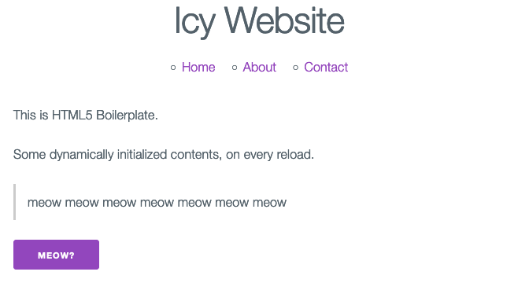

# Icy Website Template



Here's a Markdown README file that people will see when looking at the repo.

Here's a few examples: [https://github.com/matiassingers/awesome-readme](https://github.com/matiassingers/awesome-readme)

## Requirements

A GitHub account: [https://github.com/](https://github.com/)

Git: [https://git-scm.com/](https://git-scm.com/)

Maybe a GUI Git client: [https://www.sourcetreeapp.com/](https://www.sourcetreeapp.com/) (others exist, like Git Cola, GitKraken and so on)

Node and npm: [https://nodejs.org/en](https://nodejs.org/en)

## Technologies

HTML5 boilerplate: [https://html5boilerplate.com/](https://html5boilerplate.com/)

Milligram CSS: [https://milligram.io/](https://milligram.io/)

jQuery: [https://jquery.com/](https://jquery.com/)

A super basic setup, something like Vue/React/Angular/Svelte might be better for more serious apps. This doesn't even have a custom router.

## Development

### Get code

Clone project with:
```
git clone https://github.com/SOME_USER_GOES_HERE/IcyWebsiteTemplate.git
```

### Run

Install dependencies with:
```bash
npm install
```

Run for development with:
```bash
npm run start
```

The browser will open with the page.

### Build

Build for deployment on server (if ever needed) with:
```bash
npm run build
```

The build files will be in the `dist` folder.